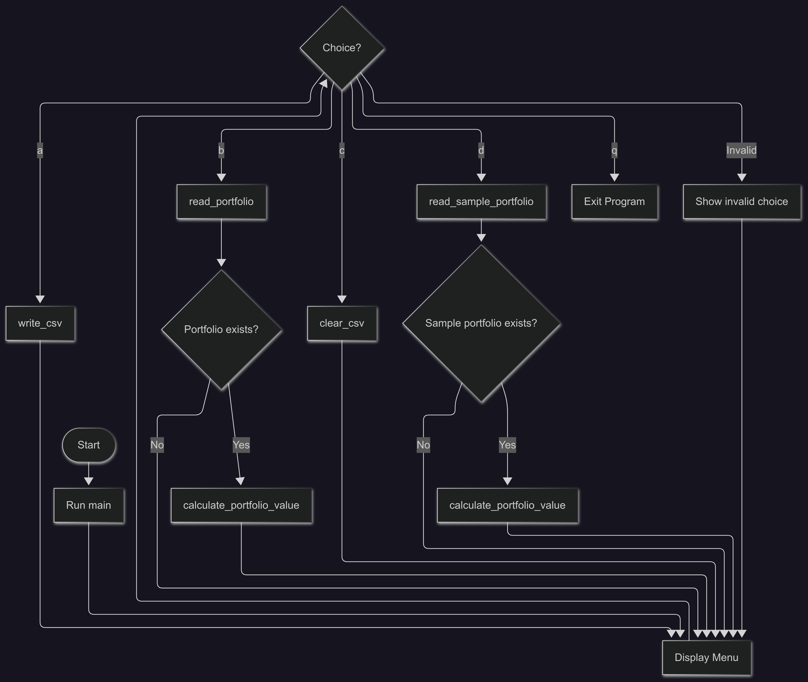

# Portfolio Analyzer

A **learning-oriented** Python application designed to demonstrate **asynchronous programming** concepts using real-world stock portfolio analysis.

This project was specifically created to learn and demonstrate:
- **Asynchronous Programming** with `asyncio`
- **Concurrent API calls** for improved performance
- **Real-time data fetching** from financial APIs
- **Exception handling** in async environments
- **Menu-driven applications** with user interaction

## Asynchronous programming

Asynchronous programming allows a program to handle multiple tasks concurrently without blocking the main execution thread. Unlike traditional synchronous programming where each operation must complete before the next one begins, async programming can start multiple operations and switch between them as they wait for resources (like network responses).

**Synchronous (Traditional) Approach:**
```
Fetch Stock A → Wait 2s → Fetch Stock B → Wait 2s → Fetch Stock C → Wait 2s
Total Time: 6 seconds
```

**Asynchronous Approach:**
```
Fetch Stock A ┐
Fetch Stock B ├─ All happen simultaneously → Wait 2s → All complete
Fetch Stock C ┘
Total Time: 2 seconds
```

The program fetches stock prices from an API. Instead of waiting for each stock's price individually (which would be slow), it requests all stock prices at the same time and process results as they arrive.

### Real-World Benefits:
- **I/O Bound Operations**: Perfect for network requests, file operations, database queries
- **Better Resource Utilization**: CPU isn't idle while waiting for external responses
- **Improved User Experience**: Application remains responsive during long operations
- **Scalability**: Can handle many concurrent operations efficiently

### Async Concepts Used:
- **`async def`** - Defining asynchronous functions
- **`await`** - Waiting for asynchronous operations
- **`asyncio.create_task()`** - Creating concurrent tasks
- **`asyncio.run()`** - Running the main async function
- **`asyncio.gather()`** - Waiting for multiple tasks (implicit in task loops)

### Performance Benefits:
- **Sequential**: 6 stocks × 2 seconds each = ~12 seconds
- **Concurrent**: All 6 stocks simultaneously = ~2 seconds
- **~6x faster** portfolio evaluation!

## Features

- Write entries in portfolio
- Display and evaluate your portfolio
- Clear portfolio data
- Display and evaluate sample portfolio
- Concurrent stock data fetching for improved performance
- Real-time price updates from Yahoo Finance API
- Comprehensive error handling for file operations and network requests
- Input validation for user entries
- Graceful handling of invalid stock symbols
- Non-blocking user interface
- Empty portfolio detection

## Program Flow



## Installation

### Prerequisites:
- Python 3.7+ (for asyncio support)
- Internet connection (for stock data)

### Install Dependencies:
```bash
pip install -r requirements.txt
```

### Required Packages:
```
yfinance>=0.2.18    # Yahoo Finance API for stock data
pandas>=2.0.0       # Data manipulation and analysis
```

**Note**: `asyncio` is part of Python's standard library (Python 3.4+) and doesn't need separate installation.

## How to Run

```bash
python main.py
```
